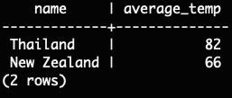

# CHALLENGE 1: All of the vacation destinations  
Query:   
Results:   
# CHALLENGE 2: All destinations where you can swim at the beach  
Query:   
Results:   
# CHALLENGE 3: All destinations where the average temperature is over 60 degrees  
Query:   
Results:   
# CHALLENGE 4: All destinations where you can swim at the beach AND go to the mountains  
Query:   
Results:   
# CHALLENGE 5: All destinations where flights cost less than $500 and you can hike in the mountains  
Query:   
Results:   
# CHALLENGE 6: Add an entry for The Bahamas, where the average temperature is 78, it has beaches but no mountains, and the flights cost $345  
Query:   
Results:   

