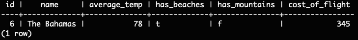

# CHALLENGE 1: All of the vacation destinations  
Query:   
Results:   
# CHALLENGE 2: All destinations where you can swim at the beach  
Query:   
Results:   
# CHALLENGE 3: All destinations where the average temperature is over 60 degrees  
Query:   
Results:   
# CHALLENGE 4: All destinations where you can swim at the beach AND go to the mountains  
Query:   
Results:   
# CHALLENGE 5: All destinations where flights cost less than $500 and you can hike in the mountains  
Query:   
Results:   
# CHALLENGE 6: Add an entry for The Bahamas, where the average temperature is 78, it has beaches but no mountains, and the flights cost $345  
Query:   
Results:    
# CHALLENGE 7: Turns out, the cost of flights to New Zealand has increased! Update New Zealand's entry for flight cost to $1000  
Query:   
Results:    
# CHALLENGE 8: Turns out, Minnesota isn't a vacation destination. Please delete it from the database   
Query:   
Results:   
# CHALLENGE 9: When the data set was written, the author mistakently wrote "England" when they actually meant "Scotland". Please update that entry in the database  
Query:   
Results:   
# CHALLENGE 10: Create a join table that joins the airlines and the destinations tables by correlating which airlines fly to which destinations  
Query:   
Results:   
# CHALLENGE 11: All airlines that fly to New Zealand  
Query:   
Results:   
# CHALLENGE 12: All airlines that do NOT fly to Scotland  
Results:   
Query:   
# CHALLENGE 13: All of the data for all vacation destinations   
Results:   
Query:   